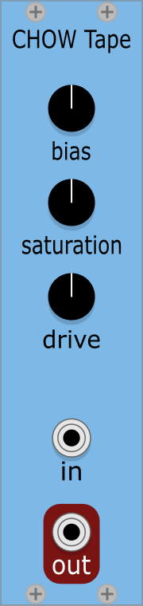
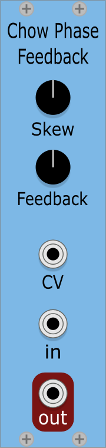
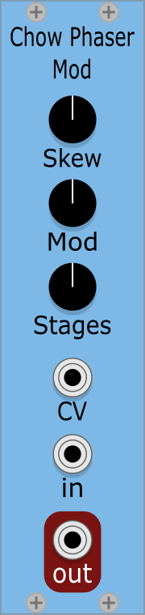
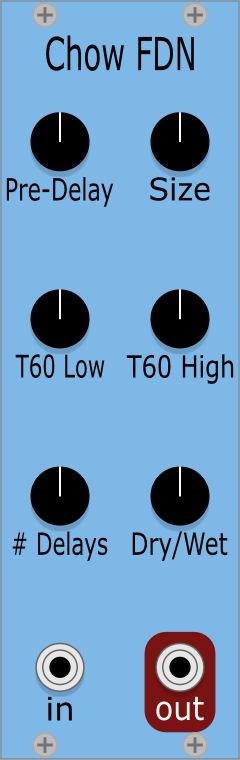
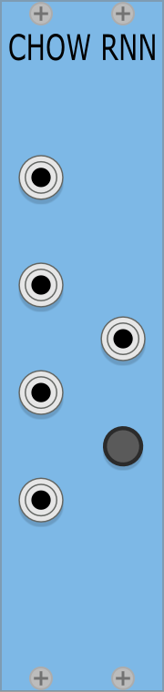
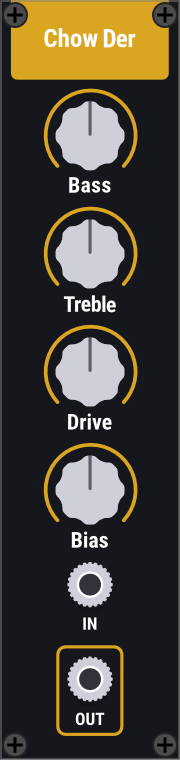
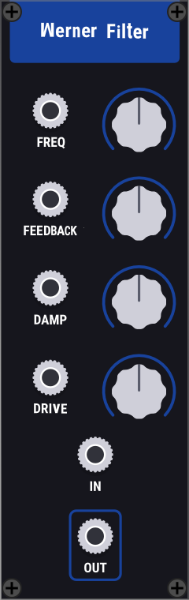
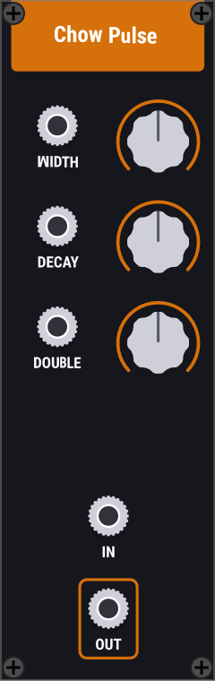
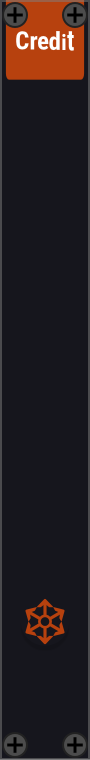

# ChowDSP for VCV

[](https://www.gnu.org/licenses/gpl-3.0)
[](https://dev.azure.com/jatinchowdhury18/ChowDSP-VCV/_build/latest?definitionId=1&branchName=master)

This repository contains [ChowDSP](https://ccrma.stanford.edu/~jatin/chowdsp) modules for [VCV Rack](https://vcvrack.com/). Official releases can be installed from the [VCV Rack Library](https://library.vcvrack.com/ChowDSP).



For more information, see the [User Manual](./doc/manual.md).

## Building
To build these plugins, you must have the [VCV Rack development environment](https://vcvrack.com/manual/Building#building-rack-plugins) set up. Then use the following commands:
```bash
# clone repository
$ git clone https://github.com/jatinchowdhury18/ChowDSP-VCV.git

$ cd ChowDSP-VCV

$ make install
```

The ChowDSP-VCV repository also contains a benchmarking suite. For more information on building and running benchmarks, see the [benchmark documentation](./doc/bench.md).

## Credits

ChowDSP VCV uses the [Eigen](http://eigen.tuxfamily.org/) and [r8lib](https://people.sc.fsu.edu/~jburkardt/f_src/r8lib/r8lib.html) libraries for linear algebra, as well as Stefano D'Angelo's [Wright Omega function approximations](http://www.dangelo.audio/dafx2019-omega.html).

Module design assisted by [Margus Mets](mailto:hello@mmcreative.eu).

## License

ChowDSP VCV Modules are licensed under the GPLv3 license. Enjoy!
