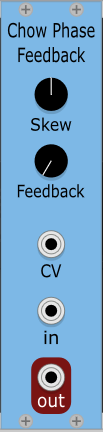
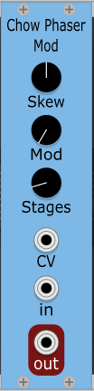
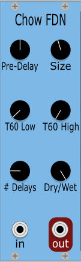
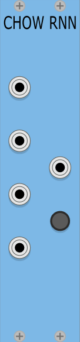

# ChowDSP for VCV

[](https://www.gnu.org/licenses/gpl-3.0)
[](https://dev.azure.com/jatinchowdhury18/ChowDSP-VCV/_build/latest?definitionId=1&branchName=master)

This repository contains [ChowDSP](https://ccrma.stanford.edu/~jatin/chowdsp) plugins built as VCV Rack modules.

To build these plugins, you must have the [VCV Rack development environment](https://vcvrack.com/manual/Building#building-rack-plugins) set up. Then use the following commands:
```bash
# clone repository
$ git clone https://github.com/jatinchowdhury18/ChowDSP-VCV.git

$ cd ChowDSP-VCV

$ make install
```

# Modules

## CHOW Tape


CHOW Tape is a port of the [CHOW Tape Model](https://github.com/jatinchowdhury18/AnalogTapeModel) audio plugin. Has controls for tape **bias**, **saturation**, and **drive**.

For more information on the physical modelling and signal processing happening internally, check out [this blog post](https://medium.com/@jatinchowdhury18/complex-nonlinearities-episode-3-hysteresis-fdeb2cd3e3f6) or for more technical readers, check out [this DAFx paper](http://dafx2019.bcu.ac.uk/papers/DAFx2019_paper_3.pdf) on tape modelling.

## CHOW Phaser
 

CHOW Phaser is made up of two modules that together make up a port of the [CHOW Phaser](https://github.com/jatinchowdhury18/ChowPhaser) audio plugin. For a typical phaser effect, use a bipolar LFO as the CV input.

The **skew** knob emphasises different parts of the CV input, in a way inspired by the behaviour of Light-Dependent Resistors (LDRs).


The Feedback module contains two modulating allpass stages arranged in a feedback architecture. The amount of feedback is controll by the **feedback** knob.

The Mod module contains a series of modulating allpass stages. The **mod** knob controls the mix of the modulated signal. The **stages** knob controls the number of allpass stages used.

## CHOW FDN


A [feedback delay network](https://ccrma.stanford.edu/~jos/cfdn/Feedback_Delay_Networks.html) reverb, with controls for **pre-delay**, room **size**, decay times (**T60 Low** and **T60 High**), and **dry/wet** mix. You can use any **number of delay lines** up to 16, but note that more delay lines will use more CPU.

## CHOW RNN


A [Recurrent Neural Network](https://en.wikipedia.org/wiki/Recurrent_neural_network) with 4 inputs and 1 output. The network architecture is as follows: the input channels are fed through a fully-connected layer containing 4 "neurons", followed by a recurrent layer consisting of 4 [Gated Recurrent Units](https://en.wikipedia.org/wiki/Gated_recurrent_unit). The output of the recurrent layer is then fed through another fully-connected layer, this time containing only a single neuron, that essentially performs a weighted sum on the 4 inputs. To change the weights of the RNN, use the randomise button.

## License

ChowDSP VCV Modules are licensed under the GPLv3 license. Enjoy!
