# Manual

ChowDSP-VCV contains the following modules:
  - [CHOW Tape](#chow-tape)
  - [CHOW Phaser](#chow-phaser)
  - [CHOW FDN](#chow-fdn)
  - [CHOW RNN](#chow-rnn)
  - [CHOW Modal](#chow-modal)
  - [CHOW Der](#chow-der)
  - [Werner Filter](#werner-filter)
  - [CHOW Pulse](#chow-pulse)
  - [Credit](#credit)
  - [Warp](#warp)
  - [CHOW Chorus](#chow-chorus)

## CHOW Tape
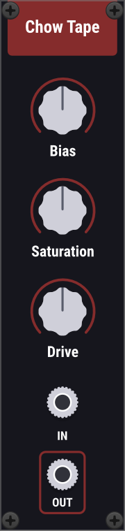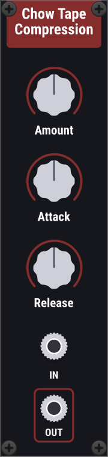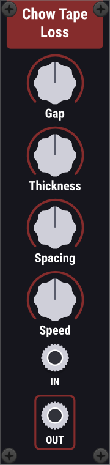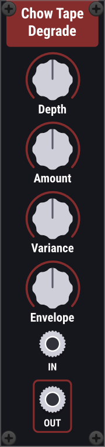

The CHOW Tape modules are a port of the [CHOW Tape Model](https://github.com/jatinchowdhury18/AnalogTapeModel) audio plugin. For more information on the modules and their controls, please see the plugin's [user manual](https://chowdsp.com/manuals/ChowTapeManual.pdf), which explains each section in detail. Note that the oversampling used by the "Chow Tape" module can be controlled via the right-click menu. The tape modelling process used in these modules is explained further in this 2019 [DAFx paper](http://dafx2019.bcu.ac.uk/papers/DAFx2019_paper_3.pdf).

## CHOW Phaser
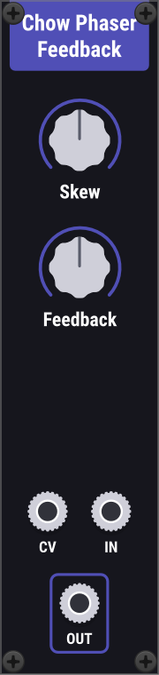 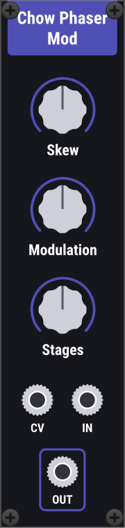

CHOW Phaser is made up of two modules that together make up a port of the [CHOW Phaser](https://github.com/jatinchowdhury18/ChowPhaser) audio plugin. For a typical phaser effect, use a bipolar LFO as the CV input.

The **skew** knob emphasises different parts of the CV input, in a way inspired by the behaviour of Light-Dependent Resistors (LDRs).

The Feedback module contains two modulating allpass stages arranged in a feedback architecture. The amount of feedback is controll by the **feedback** knob.

The Mod module contains a series of modulating allpass stages. The **mod** knob controls the mix of the modulated signal. The **stages** knob controls the number of allpass stages used.

## CHOW FDN
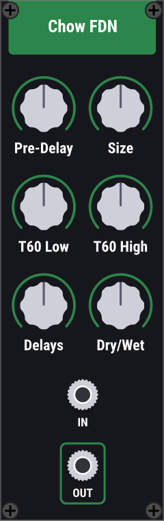

A [feedback delay network](https://ccrma.stanford.edu/~jos/cfdn/Feedback_Delay_Networks.html) reverb, with controls for **pre-delay**, room **size**, decay times (**T60 Low** and **T60 High**), and **dry/wet** mix. You can use any **number of delay lines** up to 16, but note that more delay lines will use more CPU.

## CHOW RNN
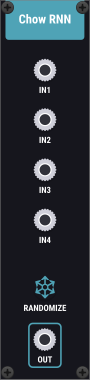

A [Recurrent Neural Network](https://en.wikipedia.org/wiki/Recurrent_neural_network) with 4 inputs and 1 output. The network architecture (shown below) is as follows: the input channels are fed through a "dense" fully-connected layer containing 4 "neurons", followed by a recurrent layer consisting of 4 [Gated Recurrent Units](https://en.wikipedia.org/wiki/Gated_recurrent_unit). The output of the recurrent layer is then fed through another fully-connected layer, this time containing only a single neuron, that essentially performs a weighted sum on the 4 inputs. To change the weights of the RNN, use the **randomise** button.

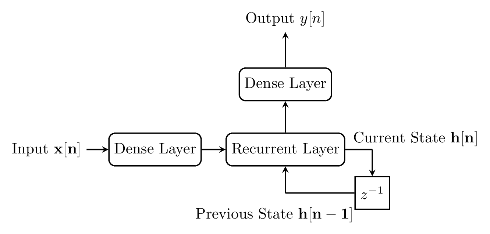

To use this module, you can connect almost any signal to the inputs, and expect to get a bipolar output (+/- 5V). A simple example using the RNN module as a waveshaping distortion effect can be seen in the [demo patch](../examples/rnn.vcv).

Under the hood, this module uses a custom-built [RNN inferencing engine](https://github.com/jatinchowdhury18/ChowDSP-VCV/tree/master/lib/MLUtils), powered by the [Eigen](http://eigen.tuxfamily.org/) linear algebra library. If you are a developer looking to use an RNN in your own module, please contact me.

## CHOW Modal
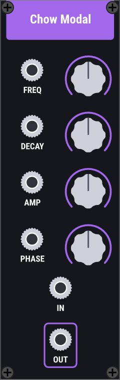

A modal filter implemented using the [Max Mathews phasor filter](https://ccrma.stanford.edu/~jos/smac03maxjos/). Includes controls for the mode's
**Frequency**, **Decay Time**, **Amplitude**, and **Phase**. These filters can be combined to synthesize things like [carillon bells](https://www.dafx.de/paper-archive/2019/DAFx2019_paper_34.pdf), or [waterbottles](https://github.com/jatinchowdhury18/modal-waterbottles). For an example see the [demo patch](../examples/modal.vcv).

## CHOW Der
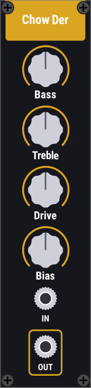

A vintage distortion effect. The **Bass** and **Treble** knobs control the parameters of a vintage EQ circuit, based on the [Baxandall EQ](https://en.wikipedia.org/wiki/Peter_Baxandall), while the **Drive** knob controls the input level to a distortion circuit inspired by guitar pedals like the Klon Centaur and the Ibanez Tube Screamer. The **Bias** knob controls the mix of odd/even harmonics produced by the distortion stage. The module uses 2x oversampling by default, but the oversampling factor can be changed using the right-click menu.

Under the hood, this module uses a [real-time Wave Digital Filter library](https://github.com/jatinchowdhury18/WaveDigitalFilters), along with approximations of the Wright Omega function borrowed from [Stephano D'Angelo](http://www.dangelo.audio/dafx2019-omega.html). For more information on Wave Digital Filters and how they can be used to model analog circuits, see the original work by [Alfred Fettweis](https://www.eit.lth.se/fileadmin/eit/courses/eit085f/Fettweis_Wave_Digital_Filters_Theory_and_Practice_IEEE_Proc_1986_-_This_is_a_real_challange.pdf), as well as some more recent research by [Kurt Werner](https://searchworks.stanford.edu/view/11891203).

## Werner Filter
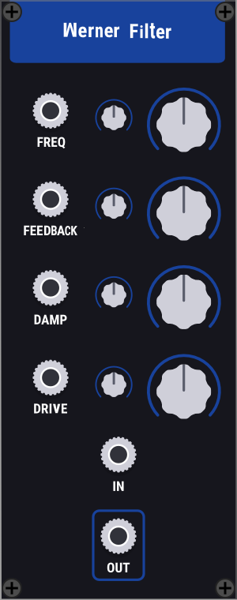

This filter is an implementation of a generalized State Variable Filter architecture (shown below), presented by Kurt James Werner and Russell McClellan at the 2020 Digital Audio Effects (DAFx) conference, with a couple nonlinear modifications. The filter has modular controls for the **frequency**, resonant **feedback**, passband **damping**, and nonlinear **drive**. The module uses 2x oversampling by default, but the oversampling factor can be changed using the right-click menu.

For more information, see the original [DAFx paper](https://dafx2020.mdw.ac.at/proceedings/papers/DAFx2020_paper_70.pdf), or the corresponding [DAFx presentation](https://dafx2020.mdw.ac.at/proceedings/presentations/paper_70.mp4). Many thanks to Kurt for his wonderful research and inspiration.

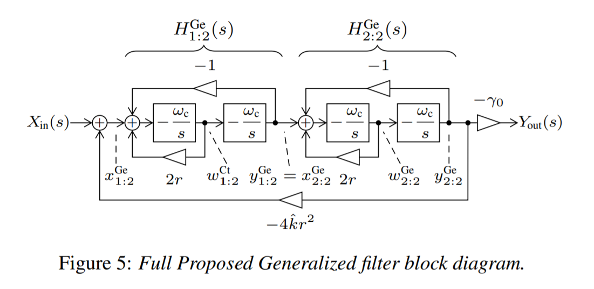

## CHOW Pulse
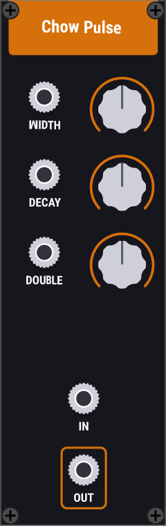

ChowPulse is a pulse shaper, modelled after the pulse shaping circuit (shown below) from the TR-808 Kick Drum circuit. The module contains controls for the **width** and **decay** time of the pulse. The pulse shaper produces a second "spike" at the end of the pulse the level of which is controlled by the **double tap** knob. The pulse shaper can function as an envelope generator, or as a pulse input for a resonant filter, such as [ChowModal](#chow-modal).

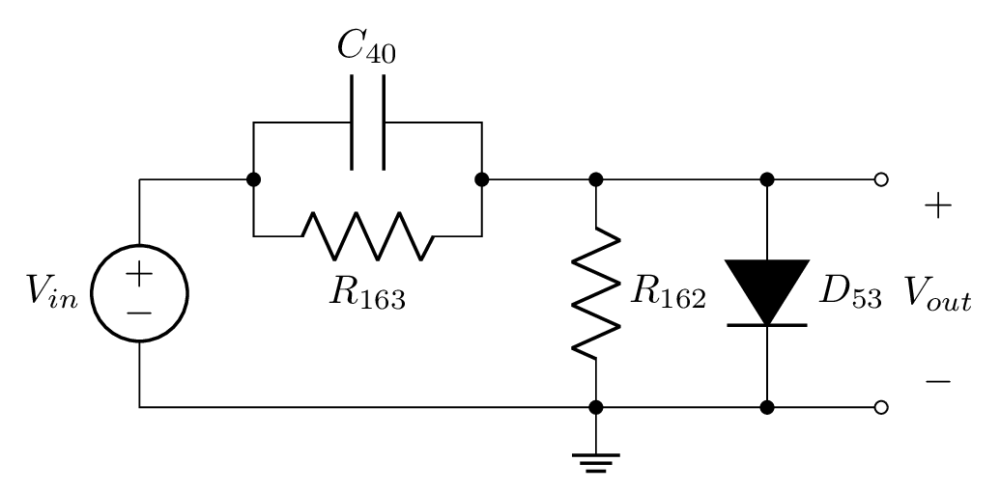

## Credit

The "Credit" module allows users to generate a text file containing credits for the modules used in a patch. To generate credits, press the red button and select a text file to save to. By default, the credits include plugin name, brand, and URL, as well as the names of each module used. More formatting options are available in the right-click menu.

## Warp
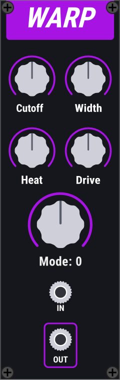

Warp is a wonky distortion module developed in collaboration with [IggyLabs](https://github.com/IggyLabs/IggyLabsModules). The DSP architecture (see below) consists of a biquad filter with a nonlinear feedback path, contained within a nonlinear delay-free loop. The biquad filter is designed in the form of a [peaking filter](https://ccrma.stanford.edu/~jos/fp/Peaking_Equalizers.html). The delay-free loop is resolved with a Newton-Raphson iteration, using a method developed by Dave Berners and Jonathan Abel in their [2016 AES paper](https://www.aes.org/e-lib/browse.cfm?elib=18489).

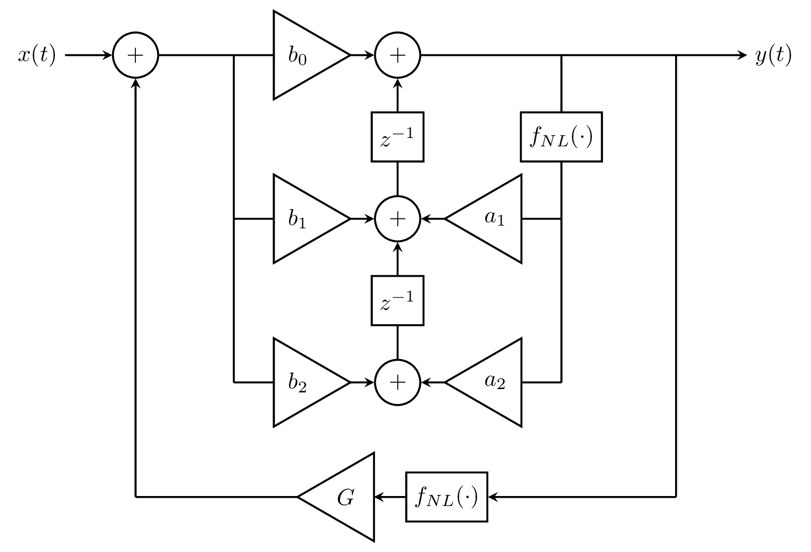

The module contains four parameters **Cutoff**, **Width**, **Heat**, and **Drive**. The meaning of those parameters is in turn controlled by the **Mode** knob, which selects a mapping that connects each of the module parameters to one or more physically meaningful parameters in the DSP system. The module uses 2x oversampling by default, but the oversampling factor can be changed using the right-click menu.

## CHOW Chorus
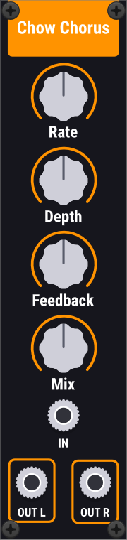

ChowChorus is an ensemble/chorus effect using delay lines that emulate a bucket-brigade device (BBD) delay circuit. The module has controls for the **rate** and **depth** of the chorusing, as well as options to control **feedback** and dry/wet **mix** over the chorus effect as a whole.

The BBD emulation used in this effect was originally implemented for the [Surge Synthesizer](https://surge-synthesizer.github.io/). The implementation here borrows a little bit from their code, including a SIMD wrapper for complex numbers.

# Questions?
If you are unsure about the functionality of any of these modules, or have any questions at all, please create a [GitHub issue](https://github.com/jatinchowdhury18/ChowDSP-VCV/issues).
